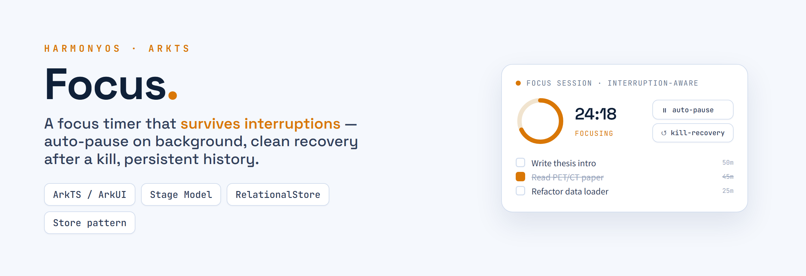
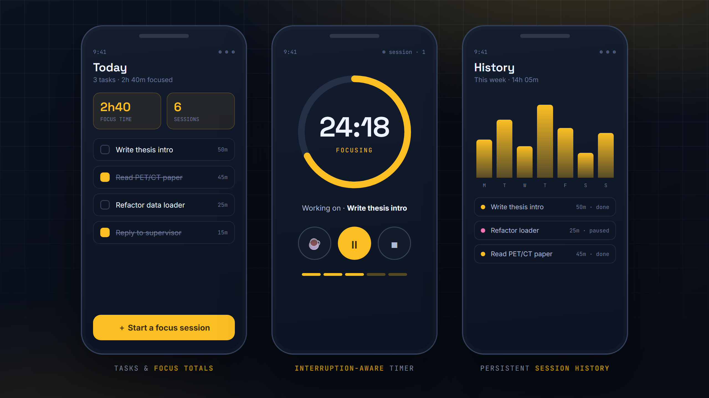
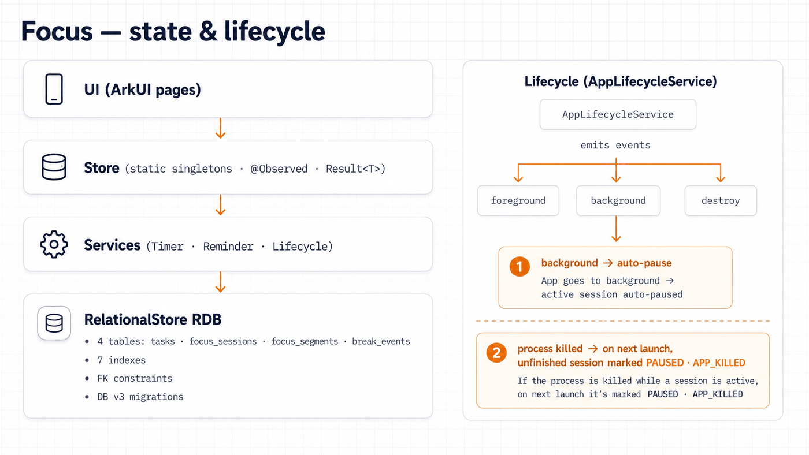
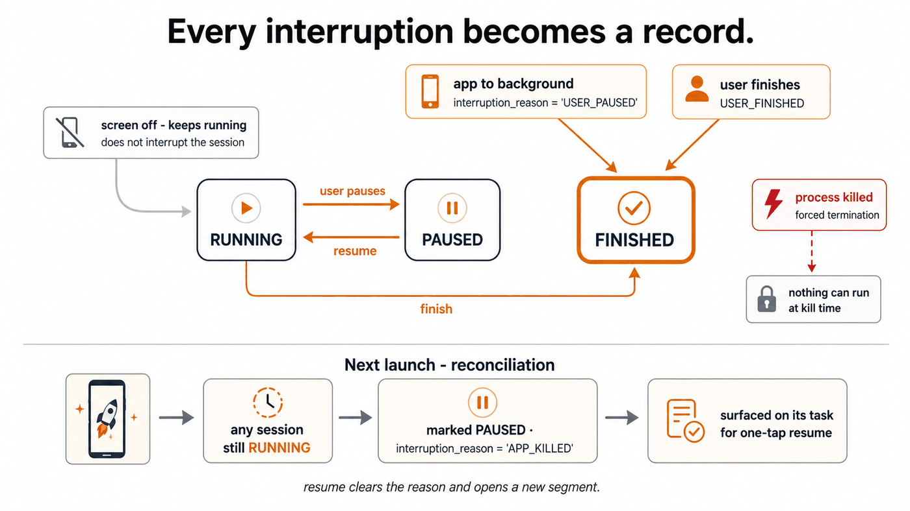

<div align="right"><a href="README.md">English</a></div>

<p align="center"></p>

<p align="center">
  
  
  
</p>

Focus 是一款基于 Stage 模型、用 ArkTS/ArkUI 构建的 HarmonyOS 专注计时与任务管理应用。它把每一次专注会话都关联到一个真实任务，把每一次中断——切后台、休息、甚至进程被杀——都作为显式的状态迁移写进关系型数据库，并在下次启动时干净地恢复，因此会话历史永远不会被悄悄丢掉。它适合任何想要一个"对实际发生的事情保持诚实"的专注工具的人。

<p align="center">
  <a href="#-快速开始">快速开始</a> ·
  <a href="#-架构">架构</a> ·
  <a href="#-数据模型">数据模型</a> ·
  <a href="#-中断模型">中断模型</a> ·
  <a href="#-文档">文档</a>
</p>

## 🧭 概览

**问题。** 大多数移动端专注计时器把"中断"当作事后补丁。切到别的应用、接个电话、或者系统直接杀掉进程，计时器要么继续为一个你早已不在的会话计时，要么把会话整个丢掉——无论哪种，历史记录都在说谎。对一个价值就在于"专注时间的诚实记录"的工具来说，这是致命缺陷。

**方案。** Focus 把每一次中断都当作一等公民事件来记录。会话是多段式的：每次暂停/恢复关闭一个片段并开启下一个，休息作为独立事件入库，每个会话都带有显式的 `interruption_reason`。一个生命周期服务监听前台/后台/销毁转换，把每个事件转化为一次数据库写入；每次启动时的对账流程会把进程被杀后悬空的会话转为可恢复的 `PAUSED` 记录，而不是留下一条没有结尾的记录。所有持久化数据落在带外键约束的 RelationalStore schema 中，迁移是幂等的、基于结构自省的。

**范围。** Focus 是单设备手机应用（`deviceTypes: ["phone"]`）。不做云同步、没有账号体系、不收集任何数据——所有数据都留在本地 RDB 中。界面语言为中文。

## ✨ 亮点

- **任务关联的多段式会话** — 完整的任务 CRUD，三种会话类型（`NORMAL` 正计时、`COUNTDOWN` 倒计时、`POMODORO` 番茄钟），暂停/恢复按片段分别记录，配套可跳过、可延长的独立休息计时器。
- **每次中断都变成记录** — 离开应用时，运行中的会话会以显式的 `USER_PAUSED` 记录被关闭（并发出通知方便一键回来）；熄屏*不*算离开，计时器在熄屏时继续运行。
- **进程被杀后的恢复** — 下次启动时，对账流程把仍处于 `RUNNING` 的会话标记为 `PAUSED`、`interruption_reason = 'APP_KILLED'`，任务列表上会浮现该会话供一键恢复，被杀掉的应用留下的是诚实、可恢复的历史。
- **可靠的关系型存储** — 4 张表的 RelationalStore schema（`tasks`、`focus_sessions`、`focus_segments`、`break_events`），外键约束、7 个索引、`SecurityLevel.S2`，迁移由 `PRAGMA table_info` 自省驱动、逐列添加、幂等。
- **比应用活得久的提醒** — 休息结束提醒通过系统 ReminderAgent 调度，应用不在前台也会触发；应用内通知覆盖"后台退出"和"休息间隔"两类场景。
- **Store 模式状态层** — 静态类单例 Store 包裹 `@Observed` 状态对象，每个数据操作都返回 `Result<T>` 成功/失败信封，并有单活跃会话守卫，UI 代码从不直接接触数据库。
- **一个不漂移的计时器** — 全局唯一的 tick 服务用时间戳差值而非累加 tick 计算耗时，误差不会累积；tick 只更新局部状态，避免整页每秒重绘。
- **引导式上手** — 首次启动的遮罩式新手引导，加一个能深链到系统专注模式设置的引导页，并为不同设备的设置路由准备了多重 `Want` 回退。

## 📸 截图

<p align="center"></p>
<p align="center"><sub>代表性界面（设计稿）：首页任务列表、专注计时器、会话历史。</sub></p>

## 🏗 架构

<p align="center"></p>
<p align="center"><sub>单向分层栈；生命周期服务把中断转化为记录在案的状态。</sub></p>

数据只朝一个方向流动，每一层只做一件事：

| 层 | 内容 |
| --- | --- |
| **Pages**（ArkUI） | 7 个页面——首页/任务列表、专注前配置、运行中计时器、历史、设置、任务编辑、新手引导——加 8 个共享组件（计时器、导航、统计卡、任务行、遮罩等）。 |
| **Stores** | `TaskStore`（任务列表）与 `FocusStore`（完整的会话/休息生命周期）——`@Observed` 状态上的静态类单例，每个操作返回 `Result<T>`。 |
| **Services** | 应用生命周期事件总线、共享 tick 计时器、ReminderAgent 封装、通知管理（3 个通道：后台退出、休息结束、休息间隔）、基于 Preferences 的设置持久化、系统设置导航器。 |
| **Data** | `RdbClient`（连接、建表、迁移、完整性检查）加每表一个仓储（`TaskRepo`、`SessionRepo`、`SegmentRepo`、`BreakRepo`），全部返回 `Result<T>`。 |

页面从不接触数据库；它们调用 Store。Store 持有业务规则——单活跃会话守卫、片段记账、休息核算——并把持久化委托给仓储层。Service 做超出单个页面生命周期的工作：生命周期总线接收来自应用 Ability 的 `foreground` / `background` / `destroy` 事件并路由进 `FocusStore`，中断在那里变成数据库写入（见[中断模型](#-中断模型)）。

<p align="center"></p>
<p align="center"><sub>每一次中断都变成显式记录——而进程被杀时无法执行任何代码，因此改在下次启动时对账。</sub></p>

## 🗃 数据模型

四张表，由外键连接（会话向下 `ON DELETE CASCADE`）：

| 表 | 关键列 | 记录什么 |
| --- | --- | --- |
| `tasks` | `title`、`created_at`、`last_completed_at`、`total_focus_time`、`session_count`、`active_session_id` | 可复用的任务；跨多次会话累积专注时长与完成次数，并指向进行中的会话以支持一键恢复。 |
| `focus_sessions` | `task_id`、`start_at`、`end_at`、`status`（`RUNNING` / `PAUSED` / `FINISHED`）、`interruption_reason`、`session_type`、`time_limit_ms`、`rest_interval_ms`、`rest_duration_ms` | 一次完整的专注坐席，带显式状态与结束/暂停原因。 |
| `focus_segments` | `session_id`、`segment_index`、`start_at`、`end_at`、`duration_ms` | 会话内一段不间断的专注——每次暂停/恢复关闭一段、开启下一段。 |
| `break_events` | `session_id`、`start_at`、`planned_duration`、`actual_duration`、`is_skipped`、`reason` | 每次休息，包括是否被跳过、应用是否在休息中退出。 |

迁移是**基于自省且幂等的**：每次连接时 `RdbClient` 逐表读取 `PRAGMA table_info`，只执行真正缺失的 `ALTER TABLE … ADD COLUMN`（必要时回填数据），随后校验四张表齐全。重复运行总是安全的，已有数据永不销毁。

## 🔄 中断模型

逐事件的精确行为：

| 事件 | Focus 的处理 |
| --- | --- |
| 应用进入**后台**（亮屏） | 运行中的会话以显式的 `USER_PAUSED` 记录被关闭，并发出通知方便一键回来。不会有任何东西在后台悄悄计时。 |
| **熄屏** | *不*视为离开——计时器继续运行。熄屏专注是预期用法，不是中断。 |
| 应用退出时**休息正在进行** | 该休息以 `APP_KILLED` 原因被结算，休息核算保持真实。 |
| 进程在会话中**被杀** | 被杀瞬间无法执行任何代码；下次启动时，对账流程把仍为 `RUNNING` 的会话改为 `PAUSED`、`interruption_reason = 'APP_KILLED'`。 |
| 被杀后的**下次启动** | 对账后的会话浮现在对应任务上供一键恢复；恢复会清除中断原因并开启新片段。 |
| 后台期间**休息到点** | 系统 ReminderAgent 定时器在应用不在前台时也会触发休息结束提醒。 |

这部分行为在真机上做过验证：切后台、从多任务界面杀进程、重新启动，历史记录始终一致。

## 🚀 快速开始

### 环境要求

- **DevEco Studio**，带 **HarmonyOS SDK 6.0.1**（API 21）工具链
- 一台 HarmonyOS 手机或 DevEco 模拟器
- 仓库不含签名材料——DevEco 的自动调试签名即可运行

### 运行

1. 用 **DevEco Studio** 打开项目根目录（IDE 会直接读取 `build-profile.json5`）。
2. 等待 IDE 同步 `oh-package.json5` 依赖（hvigor 打开时自动执行）。
3. 选择已连接的设备或模拟器并运行（**Shift+F10**）。

### 预期效果

首次启动进入首页，新手引导遮罩会依次介绍首页、计时器、历史与休息模式。创建一个任务、从任务发起一次专注、在会话中按 Home 键——通知会出现，会话以显式的暂停记录被关闭并出现在历史里，而不是消失。应用在运行时请求通知权限；提醒使用唯一声明的权限 `ohos.permission.PUBLISH_AGENT_REMINDER`。

## 🗺 项目结构

```text
entry/src/main/ets/
├── pages/            # 7 个页面：Index（首页）、StartPage、FocusPage、HistoryPage、
│                     #   SettingsPage、TaskEditPage、GuidePage
├── components/       # BottomNav、FocusTimer、BreakTimer、TaskItem、StatCard、
│                     #   NumberSelector、OnboardingOverlay、SuccessAnimation
├── store/            # focusStore（会话/休息生命周期）、taskStore（任务列表）
├── services/         # AppLifecycleService、TimerService、ReminderService、
│                     #   NotificationService、SettingsService、SettingsNavigator
├── data/             # RdbClient（建表 + 迁移）与每表一个仓储
├── model/            # Task、FocusSession、FocusSegment、BreakEvent、Result<T>
├── onboarding/       # OnboardingFlow 引导步骤配置
└── common/           # 常量、主题令牌、hilog 日志
Sample_frontend/      # ArkTS 界面的移植来源——Figma 导出的 React/TypeScript 原型
```

## 🧪 测试

单元测试脚手架已就位（**Hypium**，`@ohos/hypium` + `@ohos/hamock`）；目前不声称有项目级自动化覆盖。中断与进程被杀恢复流程在真机上做过人工验证（见[中断模型](#-中断模型)）。

## 🖥 兼容性

| 组件 | 支持情况 |
| --- | --- |
| HarmonyOS SDK | 6.0.1（API 21），Stage 模型 — `targetSdkVersion` = `compatibleSdkVersion` = `6.0.1(21)` |
| 设备类型 | 手机 |
| IDE / 构建 | DevEco Studio、hvigor |
| 界面语言 | 中文 |
| 云 / 同步 | 无 — 所有数据本地存储 |

## 📚 文档

设计与实现文档位于 [`docs/`](docs/)：

- [`ARCHITECTURE.md`](docs/ARCHITECTURE.md) — MVP 范围、Stage 模型分层与数据流
- [`BACKEND_DESIGN.md`](docs/BACKEND_DESIGN.md) — 领域模型、Store→Service→Data 调用链、`Result<T>` 约定、迁移说明
- [`FRONTEND_DESIGN.md`](docs/FRONTEND_DESIGN.md) — 页面结构、交互流、单向数据流规则
- [`PAGE_FLOW_UPDATED.md`](docs/PAGE_FLOW_UPDATED.md) — 全部 7 个页面的路由/状态表
- [`RDB_IMPLEMENTATION_REPORT.md`](docs/RDB_IMPLEMENTATION_REPORT.md) — 数据库层逐文件逐行的验证报告
- [`UI_DESIGN_SPECIFICATION.md`](docs/UI_DESIGN_SPECIFICATION.md) — 设计稿背后完整的视觉/交互规范

## 📊 项目状态

- **稳定** — 任务 CRUD、三种会话类型、片段/休息记账、历史、设置持久化、新手引导，以及上文描述的被杀恢复流程。
- **有意为之** — 回到前台不会自动恢复会话；恢复是显式的用户操作，因此永远不会把没发生的时间计入专注。
- **不在计划内** — 云同步、账号、多设备状态（分布式同步权限已预留但有意停用）。

## 👥 团队

Focus 是 **Ruixuan Liao** 与 **Ruijie Chen** 的小型协作项目。我们共同完成了任务管理、可感知中断的专注会话、RDB 持久化层与生命周期安全的恢复流程。

## 🧰 技术栈

- **语言 / UI：** ArkTS、ArkUI（声明式）、`@Observed` 状态 + AppStorage
- **平台：** HarmonyOS Stage 模型，SDK 6.0.1（API 21）
- **数据：** `@ohos.data.relationalStore`（RDB，外键约束）；`@ohos.data.preferences`（设置）
- **系统服务：** `reminderAgentManager`（定时提醒）、`notificationManager`（3 个通道）、`hilog`
- **构建 / 测试：** hvigor、`@ohos/hypium` + `@ohos/hamock`
- **设计来源：** Figma 原型，导出为 `Sample_frontend/` 中的 React/TS 工程

## 📄 许可证

以 **MIT 许可证**发布 — 见 [LICENSE](LICENSE)。

<p align="center"><sub>由 <a href="https://github.com/SensLiao">Ruixuan "Sens" Liao</a> 构建 · 悉尼大学 Advanced Computing（Honours）</sub></p>
